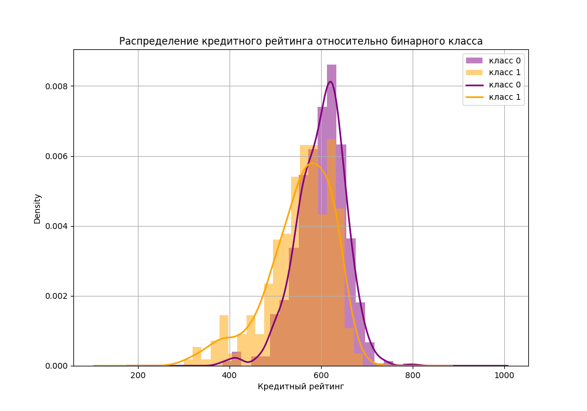
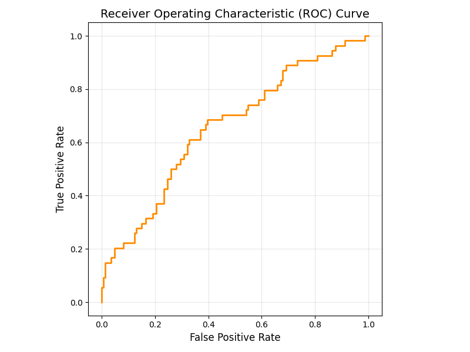
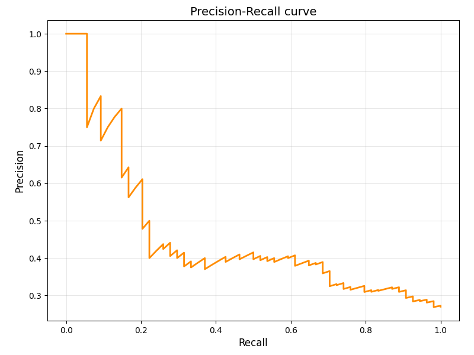

# Credit Scoring: Default Prediction and Credit Score Estimation using Linear Models

## Project overview
This project focuses on solving two classical problems in credit risk analysis:

1. Default prediction (binary classification)
2. Credit score prediction (regression)

Both tasks are solved using interpretable linear models (logistic regression and linear regression).

The project includes:

- exploratory data analysis
- feature preprocessing
- handling outliers
- model training
- handling multicollinearity
- evaluation of classification and regression models
- feature importance analysis

## Tech stack

- Python
- pandas
- numpy
- scikit-learn
- matplotlib
- seaborn
- Jupyter Notebook

## Dataset

[Dataset](https://www.kaggle.com/code/lipinpappachen/classify-customer-default) contains financial information about 1000 clients.

Targets:

- DEFAULT – binary indicator of payment default
- CREDIT_SCORE – numerical credit rating (300–800)

Features include:

- income
- debt
- savings
- spending behavior across categories
- financial ratios
- categorical indicators (credit card, mortgage, dependents, etc.)

## Project structure

├── artifacts  

│   ├── figures

│   │   ├── corr_matrixes.png

│   │   ├── PR_curve.png

│   │   ├── ROC_curve.png

│   │   └── target_distribution.png

│   ├── meta_info   # models info

│   │   ├── clf_meta.json

│   │   └── reg_meta.json

│   ├── metrics

│   │   ├── all_model_metrics.json   # all trained models metrics

│   │   ├── thr_metrics.json         # threshold experiment metrics

│   │   └── final_metrics.json       # final models test metrics

│   └── models

│   │   ├── clf.joblib

│   │   └── reg.joblib

├── credit_score.csv   # data 

├── credit_score.ipynb  

├── requirements.txt

└── README.md

## How to run

Clone repository

git clone https://github.com/polinashishova/credit-score.git

Install dependencies

pip install -r requirements.txt

Run notebook

jupyter notebook credit_score.ipynb

## Exploratory Data Analysis

Key observations:

- dataset contains 87 columns (including id)
- no missing values or duplicates
- 73 features contain outliers
- default class imbalance: 28% defaults
- strongest correlation with credit score: debt-to-income ratio

### Target distribution

## Feature preprocessing

Preprocessing pipeline:

- StandardScaler for regular features
- RobustScaler for features with outliers
- Ordinal encoding for categorical feature CAT_GAMBLING
- binary features left unchanged

## Models

Models used:

Classification:
- Logistic Regression

Regression:
- Linear Regression

Baseline models:
- DummyClassifier
- DummyRegressor

## Metrics 

Classification metrics:

- accuracy
- precision
- recall
- F1-score
- ROC-AUC
- average precision

Regression metrics:

- RMSE
- MAE
- R2

## Experimental Results

### Classification results

| Metric | Dummy Baseline | Unchanged Features | Without High Corr | Balanced Classes | Balanced Classes + Fixed Features |
|------|------|------|------|------|------|
| Accuracy | 0.605 | 0.755 | 0.750 | 0.595 | 0.620 |
| Precision | 0.281 | 0.632 | 0.643 | 0.364 | 0.380 |
| Recall | 0.296 | 0.222 | 0.167 | 0.667 | 0.648 |
| F1-score | 0.288 | 0.329 | 0.265 | 0.471 | 0.479 |
| ROC-AUC | 0.508 | 0.658 | 0.652 | 0.659 | 0.656 |
| Avg Precision | 0.273 | 0.480 | 0.464 | 0.464 | 0.458 |

### Regression results

| Metric | Dummy Baseline | Unchanged Features | Without High Corr |
|------|------|------|------|
| MSE | 3985.48 | 891.25 | 718.16 |
| RMSE | 63.13 | 29.85 | 26.80 |
| MAE | 48.86 | 21.63 | 19.72 |
| R² | -0.004 | 0.775 | 0.819 |

### Classification threshold selection

| Threshold | Accuracy | Precision | Recall | F1-score |
|----------|----------|----------|----------|----------|
| 0.20 | 0.275 | 0.269 | 0.981 | 0.422 |
| 0.25 | 0.300 | 0.276 | 0.981 | 0.431 |
| 0.30 | 0.350 | 0.287 | 0.944 | 0.440 |
| 0.35 | 0.375 | 0.292 | 0.926 | 0.444 |
| **0.40** | **0.455** | **0.318** | **0.889** | **0.468** |
| 0.45 | 0.530 | 0.333 | 0.741 | 0.460 |
| 0.50 | 0.620 | 0.380 | 0.648 | 0.479 |

Threshold analysis shows the trade-off between precision and recall.

Lower thresholds increase recall but produce many false positives.
Higher thresholds improve precision but significantly reduce recall.

The threshold 0.4 provides the best balance between precision and recall for given classification task with 89% defaults being guessed in this experiment.

## Best models

- Classification - Default prediction:
  - Logistic Regression with regularization parameter C = 0.01 (selected by grid search and cross validation) and balanced class weights
- Regression - Credit score prediction:
  - Linear Regression model

Models are trained on preprocessed data without multicollinear features

## Final metrics

### Classification

#### Metrics

| Accuracy          | 0.455    |
| Precision         | 0.318    |
| Recall            | 0.889    |
| F1-score          | 0.468    |
| ROC AUC           | 0.656    |
| Average Precision | 0.458    |

#### ROC Curve

ROC-AUC shows the trade-off between true positive rate and false positive rate.

#### Precision-Recall Curve

Precision-Recall curve is more informative for imbalanced datasets.

### Regression

| MSE           | 716.98   |
| RMSE          | 26.776   |
| MAE           | 19.72    |
| R²            | 0.819    |

## Feature importance

### Classification features

| Feature             | Coefficient | Abs. Coefficient |
| ------------------- | ----------- | ---------------- |
| **R_CLOTHING_INCOME**   | **0.257087**    | **0.257087**         |
| **R_EDUCATION_SAVINGS** | **-0.115894** | **0.115894**        |
| **CAT_CREDIT_CARD**     | **0.101148**    | **0.101148**        |
| R_FINES             | 0.096745    | 0.096745         |
| R_HEALTH_INCOME     | 0.093097    | 0.093097         |
| T_CLOTHING_6        | 0.088227    | 0.088227         |
| R_HOUSING_INCOME    | -0.072042   | 0.072042         |
| R_UTILITIES         | -0.071815   | 0.071815         |
| T_GROCERIES_6       | -0.069799   | 0.069799         |
| R_EDUCATION_INCOME  | -0.068691   | 0.068691         |

### Regression features

| Feature              | Coefficient | Abs. Coefficient |
| -------------------- | ----------- | ---------------- |
| **R_GAMBLING**           | **1875.361319** | **1875.361319**      |
| **R_GAMBLING_INCOME**   | **665.206102**  | **665.206102**      |
| **R_CLOTHING_INCOME**    | **-61.134512**  | **61.134512**        |
| R_EXPENDITURE_INCOME | -15.089144  | 15.089144        |
| CAT_SAVINGS_ACCOUNT  | 12.686407   | 12.686407        |
| R_FINES              | -8.798107   | 8.798107         |
| T_FINES_12           | 8.104477    | 8.104477         |
| R_DEBT_INCOME        | -7.922396   | 7.922396         |
| T_CLOTHING_6         | -7.161992   | 7.161992         |
| R_EXPENDITURE        | 6.347721    | 6.347721         |

